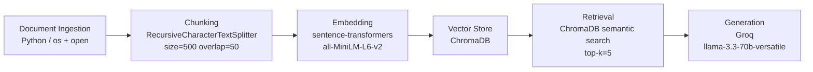

# Project 1 Planning: The Unofficial Guide

> Write this document before you write any pipeline code.
> Your spec and architecture diagram are what you'll use to direct AI tools (Claude, Copilot, etc.) to generate your implementation — the more specific they are, the more useful the generated code will be.
> Update the Retrieval Approach and Chunking Strategy sections if you change your approach during implementation.
> Update this file before starting any stretch features.

---

## Domain

<!-- What domain did you choose? Why is this knowledge valuable and hard to find through official channels? -->

**Reviews Of CS Program at Stevens Institute of Technology**
**This knowledge would be very valuable to students that are researching colleges they may want to attend one day**
**Having a good majority of the sources accumulated in one place makes it easy for students to ask questions and get reputable, relevant answers**

---

## Documents

<!-- List your specific sources: URLs, subreddit names, forum threads, or file descriptions.
     Aim for at least 10 sources that together cover different subtopics or perspectives within your domain. -->

| # | Source | Description | URL or location |
|---|--------|-------------|-----------------|
| 1 | Reddit | Student Review | https://www.reddit.com/r/stevens/comments/engineering-computer-science-students
| 2 | RateMyProf | Professor Reviews | https://www.ratemyprofessors.com/professor/2721847
| 3 | Niche | Program Reviews | https://www.niche.com/colleges/stevens-institute-of-technology/reviews/
| 4 | Unigo | Student Reviews | https://www.unigo.com/colleges/stevens-institute-of-technology/reviews
| 5 | GradReports | CS Program Reviews | https://www.gradreports.com/colleges/stevens-institute-of-technology
| 6 | RateMyProf | Reviews of Borowski's Class | https://www.ratemyprofessors.com/professor/1942070
| 7 | RateMyProf | Reviews of Brennan's Class | https://www.ratemyprofessors.com/professor/2760646
| 8 | Reddit | SubThreads of Alumni's Experience | https://www.reddit.com/r/stevens/comments/why-i-chose-stevens-cs
| 9 | Reddit | Thread of Choosing CS Program | https://www.reddit.com/r/stevens/comments/admitted-to-cs-program
| 10 | RateMyProfessor | Review of Zumrut's Class | https://www.ratemyprofessors.com/professor/2829445

---

## Chunking Strategy

<!-- How will you split documents into chunks?
     State your chunk size (in tokens or characters), overlap size, and explain why those
     numbers fit the structure of your documents.
     A review-heavy corpus warrants different chunking than a long FAQ. -->

**Chunk Strategy: Recursive**

**Chunk size: 500**

**Overlap: 50**

**Reasoning: The Content of the Documents is primarily short to medium length. 500 characater is large enough to capture a complete review though whle small enough to keep chunks focused on a single opinion or experience. Overlap of 50 characters ensures that if a review spans a chunk boundary, the key context from the end of one chunk carries into the next one, preventing retrival from returning half a thought.**

---

## Retrieval Approach

<!-- Which embedding model are you using (e.g., all-MiniLM-L6-v2 via sentence-transformers)?
     How many chunks will you retrieve per query (top-k)?
     If you were deploying this for real users and cost wasn't a constraint, what tradeoffs
     would you weigh in choosing a different embedding model — context length, multilingual
     support, accuracy on domain-specific text, latency? -->

**Embedding model: all-MiniLM-L6-v2**

**Top-k: 5**

**Production tradeoff reflection:**

1. Accuracy: Larger models perform better on domain-specific queries but are slower

2. Latency: Local Models add embedding time at query but avoid network round trips. API models offload compute but introduce latency and dependency on external services

---

## Evaluation Plan

<!-- List your 5 test questions with their expected correct answers.
     Questions should be specific enough that you can judge whether the system's response
     is right or wrong. "What are good dining halls?" is too vague.
     "What do students say about wait times at [dining hall name] during lunch?" is testable. -->

| # | Question | Expected Answer |
|---|----------|-----------------|
| 1 | What do Stevens CS students say about internship opportunities? | Stevens CS students report strong internship opportunities with companies like Google, Microsoft, and Amazon recruiting on campus, with ~95% career outcomes and average starting salaries near $100,000. |
| 2 | What do students say about Professor Zumrut's exams? | CS385 algorithms exams are difficult, attendance and textbook reading essential. |
| 3 | What are common complaints about the Stevens CS program? | Common complaints include heavy exam-based grading, professors difficult to understand, high tuition, and weak administrative support. |
| 4 | What are the best advantages of the Stevens CS program? | Small class sizes, proximity to NYC, strong career placement, research opportunities, rigorous curriculum that prepares students well. |
| 5 | What is the ROI of Stevens CS Program? | Stevens ranks top 10-15 nationally for ROI with ~97% employment within six months and average CS starting salaries near $100,000. |

## Anticipated Challenges

<!-- What could go wrong? Name at least two specific risks with reasoning.
     Consider: noisy or inconsistent documents, missing source attribution, off-topic
     retrieval, chunks that split key information across boundaries. -->

1. Chunk boundary splits. Some documents are long enough that a key fact might get split across two chunks. 

2. Conflicting Opinions: There are different opinions and reviews about the same professor and program. 

---

## Architecture

---

<!-- For each part of the pipeline below, describe:
     - Which AI tool you plan to use (Claude, Copilot, ChatGPT, etc.)
     - What you'll give it as input (which sections of this planning.md, which requirements)
     - What you expect it to produce
     - How you'll verify the output matches your spec

     "I'll use AI to help me code" is not a plan.
     "I'll give Claude my Chunking Strategy section and ask it to implement chunk_text()
     with my specified chunk size and overlap" is a plan. -->

## AI Tool Plan

| Pipeline Component | AI Tool | Input Provided | Expected Output |
|-------------------|---------|----------------|-----------------|
| Document ingestion + cleaning | Claude | Documents section of planning.md, sample raw .txt files | Python script to load and clean documents from the data/ folder |
| Chunking | Claude | Chunking Strategy section of planning.md, pipeline diagram | Implementation of RecursiveCharacterTextSplitter with chunk size 500 and overlap 50 |
| Embedding + Vector Store | Claude | Retrieval Approach section of planning.md, pipeline diagram | Script to embed chunks with all-MiniLM-L6-v2 and store in ChromaDB with source metadata |
| Retrieval function | Claude | Retrieval Approach section, pipeline diagram | Function that accepts a query string and returns top-5 most relevant chunks with source info |
| Generation + grounding | Claude | Pipeline diagram, grounding requirement, output format spec | LLM prompt template using Groq that answers only from retrieved context with source attribution |
| Query interface | Claude | Interface requirements, Gradio skeleton from spec | Gradio web UI with query input, answer output, and sources display |

**Milestone 3 — Ingestion and chunking:**

**Milestone 4 — Embedding and retrieval:**

**Milestone 5 — Generation and interface:**
